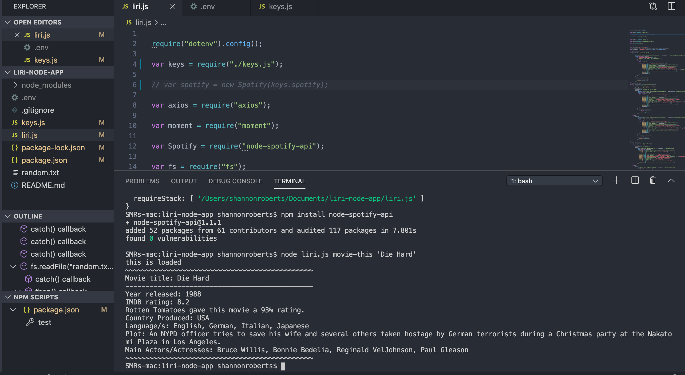
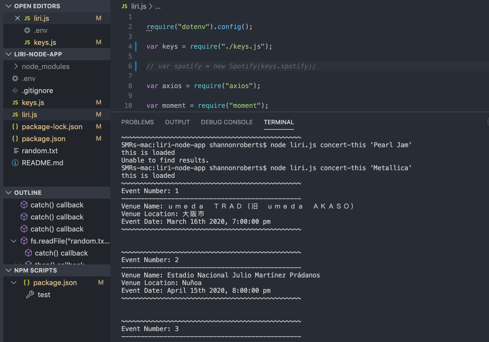
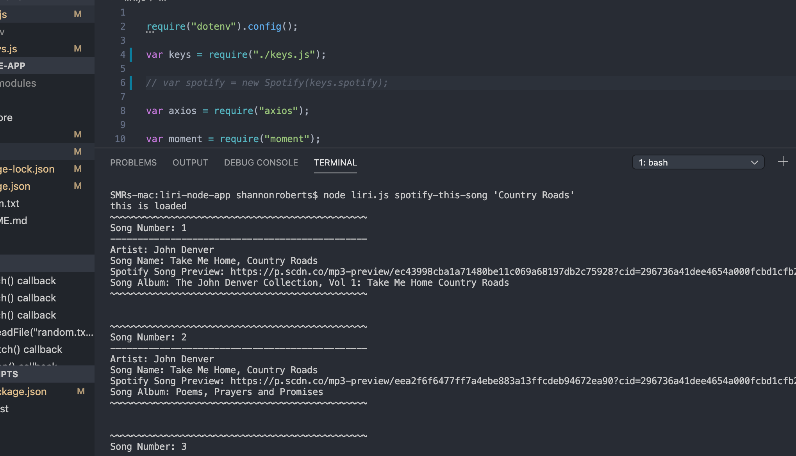
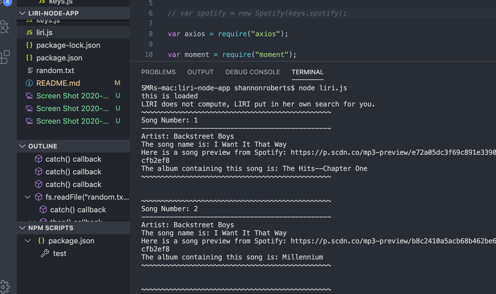

# liri-node-app
Homework 10

LIRI will search Spotify for songs, Bands in Town for concerts, and OMDB for movies.

Using Node packages via Axios to grab data from OMDB API, Node-Spotify-API, Bands in Town API, Moment, and DotEnv.

User: to use the app, type in terminal "node liri.js movie-this '<name of movie>'" for movie data. Type "node liri.js concert-this '<name of band>'" for concert information. 
Type "node liri.js spotify-this-song '<song title>'" for song information.
Or you can type "node liri.js" and leave it blank to see what LIRI came up with for you.

Screen shots of the app output:

Solo developer of this app
